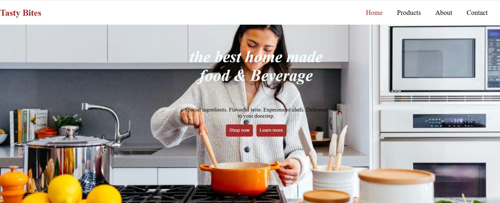

# 🍽️ Tasty Bites

Live Demo 👉 [tasty-bites0.netlify.app](https://tasty-bites0.netlify.app/)

Tasty Bites is a responsive and visually appealing website designed to showcase delicious meals and food offerings. Built with HTML, CSS, and a sprinkle of JavaScript, it's perfect for a restaurant, food blog, or personal project.

---

## 📸 Preview

 <!-- Replace with an actual screenshot path if available -->

---

## 🚀 Features

- ✅ Fully responsive layout for mobile, tablet, and desktop
- ✅ Clean, modern UI/UX
- ✅ Interactive navigation menu
- ✅ Multiple pages: Home, About, Menu, Contact
- ✅ Deployed via Netlify

---

## 🛠️ Tech Stack

- HTML5
- CSS3
- JavaScript (Vanilla)
- Netlify (for deployment)

---

## 📁 Project Structure

```

tasty-bites/
├── assets/          # Images and media
├── pages/           # HTML sub-pages (about.html, menu.html, contact.html)
├── scripts/         # JavaScript files
├── styles/          # CSS stylesheets
├── index.html       # Homepage
└── README.md        # Project documentation

````

---

## 🚀 Getting Started (Local Setup)

If you'd like to run this project locally:

1. **Clone the repository**
   ```bash
   git clone https://github.com/yasmin-mohamed5/tasty-bites.git
````

2. **Navigate into the project directory**

   ```bash
   cd tasty-bites
   ```

3. **Open `index.html` in your browser**
   You can simply double-click the file or use a live server in your code editor.

---

## 🌐 Deployment

This project is deployed using **Netlify** and is accessible at:

🔗 [https://tasty-bites0.netlify.app](https://tasty-bites0.netlify.app)

---

## 🙋‍♀️ Author

Made with ❤️ by **[Yasmin Mohamed](https://github.com/yasmin-mohamed5)**
Feel free to connect!
